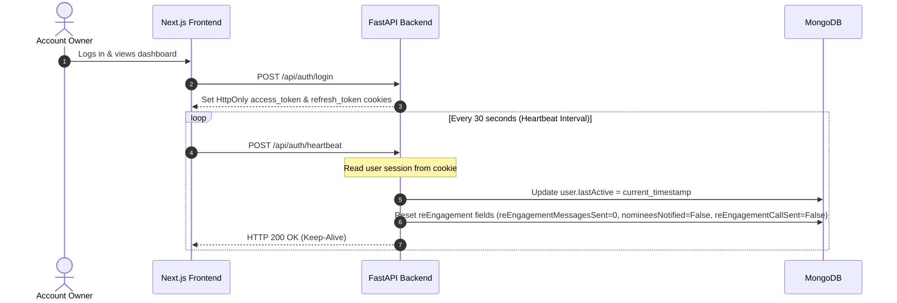
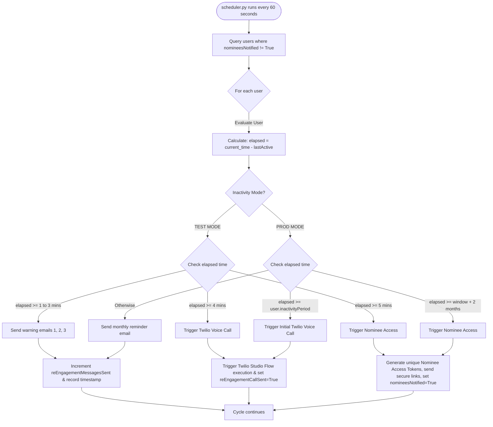
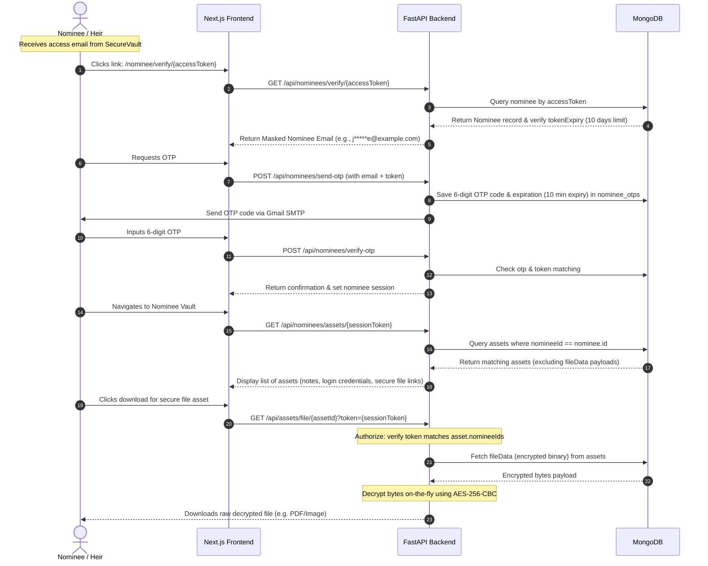

# SecureVault — Comprehensive Project Overview & Architecture Guide

Welcome to **SecureVault**, a secure digital asset inheritance platform (often referred to as a "Dead Man's Switch"). This document provides a highly detailed explanation of the platform's core concepts, architecture, working mechanisms, implemented components, and database structures.

---

## 🎯 1. CORE CONCEPT & BUSINESS VALUE

### The Problem
In the digital age, a significant portion of our assets, memories, credentials, and records exist online. If an individual passes away or becomes incapacitated:
1. **Access Barriers**: Traditional platforms block heirs from gaining access without lengthy legal procedures (probate, court orders).
2. **Permanent Data Loss**: Critical accounts, crypto wallets, and sentimental photographs can be locked forever.
3. **Privacy Compromise**: Sharing raw passwords via paper notes or insecure channels leaves users vulnerable to theft while alive.

### The Solution
SecureVault offers a proactive, secure, automated, and legal-tech mechanism to transfer digital assets to heirs (nominees) only when a user is confirmed inactive. 
- **Privacy First**: Assets remain AES-256 encrypted at rest; no unauthorized third parties can access them.
- **Zero-Trust**: The backend operates on strict ownership verification. Files are encrypted on upload and only decrypted on authorized downloads.
- **Fail-Safe Monitoring**: A continuous background scheduler monitors user activity via a client-side heartbeat.
- **Phased Escalation**: Inactivity triggers a gradual warning system (emails, automated phone calls) before granting nominee access.

---

## 🏗️ 2. SYSTEM ARCHITECTURE & TOPOLOGY

SecureVault is built on a modern 3-tier architecture with separate frontend and backend layers, utilizing NoSQL database storage and third-party notification handlers.

```mermaid
graph TD
    %% Frontend Clients
    subgraph Client Layer (Frontend)
        UA[User / Owner Dashboard] -->|HTTPS Requests & Heartbeat| NG[Next.js App Client]
        NM[Nominee Verification Pages] -->|HTTPS Requests & OTP verification| NG
    end

    %% Backend Server
    subgraph Server Layer (Backend)
        NG -->|Proxied requests| FA[FastAPI Python Engine]
        
        %% Core subsystems
        subgraph FastAPI Core Subsystems
            API[API Routers: Auth, Assets, Nominees]
            SEC[Security & Encryption Engine: AES-256 + Bcrypt]
            SCH[APScheduler Background Worker]
        end
        FA --- API
        FA --- SEC
        FA --- SCH
    end

    %% Database & External Services
    subgraph Infrastructure Layer
        API -->|Async Motor Client| MD[(MongoDB Atlas Cloud)]
        SCH -->|Check users & update states| MD
        
        %% Third-party APIs
        SCH -->|Trigger Studio Flow execution| TW[Twilio Voice Call API]
        SCH -->|Send Alerts / Nominee Links| EM[Gmail SMTP Server]
        API -->|Send nominee verification codes| EM
    end

    classDef client fill:#3b82f6,stroke:#1d4ed8,color:#fff;
    classDef server fill:#10b981,stroke:#047857,color:#fff;
    classDef infra fill:#f59e0b,stroke:#d97706,color:#fff;
    class UA,NM,NG client;
    class FA,API,SEC,SCH server;
    class MD,TW,EM infra;
```

---

## 🔄 3. CORE WORKFLOWS & DATA FLOWS

SecureVault relies on three primary workflows that connect the client, server, and background worker.

### Workflow A: Active State & Monitoring (Heartbeat)
While the user is alive and active, the frontend sends periodic requests to keep the account active.



---

### Workflow B: The Escalation & Notification Protocol (Background Scheduler)
If the user stops interacting with the platform (closes browser, doesn't refresh session), the scheduler takes action.



---

### Workflow C: Nominee Verification & Asset Retrieval
Once nominee access is triggered, nominees retrieve the assets assigned to them.



---

## 🛠️ 4. WHAT IS IMPLEMENTED (TECHNICAL MODULES)

### 🔑 A. Advanced Authentication & Session Management
- **JWT Middleware** (`backend/app/core/security.py`):
  - Token signing using `HMAC-SHA256`.
  - Dual token configuration: 60-minute **Access Tokens** and 7-day **Refresh Tokens** stored in secure, **HttpOnly cookies** to prevent XSS session theft.
  - **Refresh Token Rotation & Revocation**: Refresh tokens are stored in the database. When a token is refreshed, the old refresh token is atomically verified, deleted from the DB (consumed), and a new pair is issued to prevent replay attacks.
- **Dual-Factor Protection (PIN & 2FA)**:
  - Users set a **6-digit security PIN** during registration. PIN verification is required for critical asset updates and dashboard loading.
  - Optional **Google Authenticator (TOTP)** integration using `pyotp` to generate/verify authenticator tokens.
  - Google OAuth integration for one-click login and profile completion.

### 🛡️ B. Zero-Trust Encryption Architecture
- **Text/Password Encryption** (`backend/app/lib/encryption.py`):
  - Symmetric encryption using `AES-256-CBC` with `PKCS7` padding.
  - Encrypted items are serialized as `iv_hex:ciphertext_hex` before saving into MongoDB.
- **Secure File Storage-at-Rest**:
  - Uploaded files are encrypted using `encrypt_bytes(file_content)` before inserting into the database.
  - Files are stored directly in MongoDB as **GridFS/Binary buffers** rather than loose files on the server's hard drive, removing local disk permission leaks.
  - Safe file download router `/api/assets/file/{asset_id}` checks if the requester is the owner (via browser auth cookie) or an authorized nominee (via nominee access token) before decrypting on-the-fly.

### ⏰ C. Active Re-Engagement Scheduler
- **APScheduler Service** (`backend/app/lib/scheduler.py`):
  - Background loop running every 60 seconds checking for inactive accounts.
  - **Inactivity Period**: Configurable per user (defaulting to 6 months).
  - **Warning Escalations**:
    - Generates and dispatches HTML warning emails.
    - Triggers an automated phone call using the **Twilio Studio Flow API** (`client.studio.v2.flows.executions.create`).
    - Grants nominees secure inheritance keys after the escalation grace period expires.

---

## 🗄️ 5. DATABASE SCHEMA DESIGN

The database is built on MongoDB. Here are the key collection structures:

### 1. `users` Collection
Tracks user profile, authentication factors, plan limits, and scheduler parameters.
```json
{
  "_id": "ObjectId",
  "fullName": "John Doe",
  "email": "johndoe@example.com",
  "phone": "+1234567890",
  "password": "$2b$12$...[bcrypt hashed password]",
  "pin": "$2b$12$...[bcrypt hashed 6-digit PIN]",
  "dob": "1990-01-01",
  "plan": "free", // free, pro, enterprise
  "storageLimit": 524288000, // 500MB in bytes
  "storageUsed": 0,
  "lastActive": "2026-07-07T19:40:00Z",
  "createdAt": "2026-07-01T10:00:00Z",
  
  // Re-engagement state fields
  "logoutTime": null,
  "reEngagementCallSent": false,
  "reEngagementMessagesSent": 0,
  "reEngagementLastMessageAt": null,
  "nomineesNotified": false
}
```

### 2. `assets` Collection
Holds sensitive user records. Text fields or file binaries are stored in an encrypted format.
```json
{
  "_id": "ObjectId",
  "id": "unique-asset-string-id",
  "userId": "ObjectId-string",
  "name": "My Bitcoin Wallet Seed",
  "type": "login-credentials", // login-credentials, document, legal-file, private-note, etc.
  "description": "Seed phrase recovery code",
  "content": "iv_hex:ciphertext_hex", // Encrypted text content (if notes/credentials)
  "fileName": "wallet_backup.pdf",
  "fileSize": 1048576, // 1MB
  "mimeType": "application/pdf",
  "filePaths": "/api/assets/file/unique-asset-string-id",
  "fileData": "Binary(encrypted_file_bytes)", // Encrypted file bytes stored at rest
  "isEncrypted": true,
  "nomineeId": "nominee-string-id", // Primary nominee
  "nomineeIds": ["nominee-string-id"], // Multi-nominee assignments
  "createdAt": "2026-07-02T12:00:00Z",
  "updatedAt": "2026-07-02T12:00:00Z"
}
```

### 3. `nominees` Collection
Stores beneficiary details and temporary access keys.
```json
{
  "_id": "ObjectId",
  "id": "unique-nominee-string-id",
  "userId": "owner-user-id",
  "name": "Jane Doe",
  "email": "janedoe@example.com",
  "phone": "+1987654321",
  "relation": "Spouse",
  "accessToken": "hex_token_string_generated_during_escalation",
  "tokenExpiry": "2026-07-17T19:40:00Z", // 10 days access window
  "userName": "John Doe", // Owner's full name cached for notifications
  "createdAt": "2026-07-02T12:15:00Z",
  "updatedAt": "2026-07-07T19:40:00Z"
}
```

### 4. `nominee_otps` Collection
Stores short-lived verification codes for nominee login verification.
```json
{
  "_id": "ObjectId",
  "email": "janedoe@example.com",
  "otp": "582910",
  "token": "hex_token_string_matching_nominee_accessToken",
  "expiresAt": "2026-07-07T19:50:00Z" // 10 minute expiry
}
```

---

## 🔮 6. STRATEGIC PRODUCT DEVELOPMENT IDEAS

To scale SecureVault into a market-leading digital legacy enterprise, the following features can be added in future versions:

1. **Decentralized Key Recovery (Social Recovery)**:
   - Implement **Shamir's Secret Sharing (SSS)**. 
   - Instead of storing the master decryption key on the server, split the key into 5 shares distributed among 5 trusted entities/contacts. Nominees must collect a threshold (e.g., 3 out of 5) of the shares to reconstruct the decryption key, ensuring the server cannot unilaterally decrypt files.
2. **Proof-of-Death Oracle Integration**:
   - Connect the scheduler to national death registries or public obituaries APIs.
   - Automatically cross-reference inactive users before triggering nominee access to reduce false positives.
3. **Emergency Veto Mechanism**:
   - Provide the owner with a "Panic/Veto Button" via SMS or phone response. 
   - If the user responds with "VETO" to a call, immediately reset the inactivity clock for an extended period, preventing premature legacy release.
4. **Conditional Splits & Asset Vesting**:
   - Release assets incrementally based on conditions (e.g., 50% on age 21, or releasing files sequentially).

---

*Document Version: 2.1.0*  
*Compiled: July 07, 2026*  
*Project: SecureVault Digital Asset Inheritance Platform*
