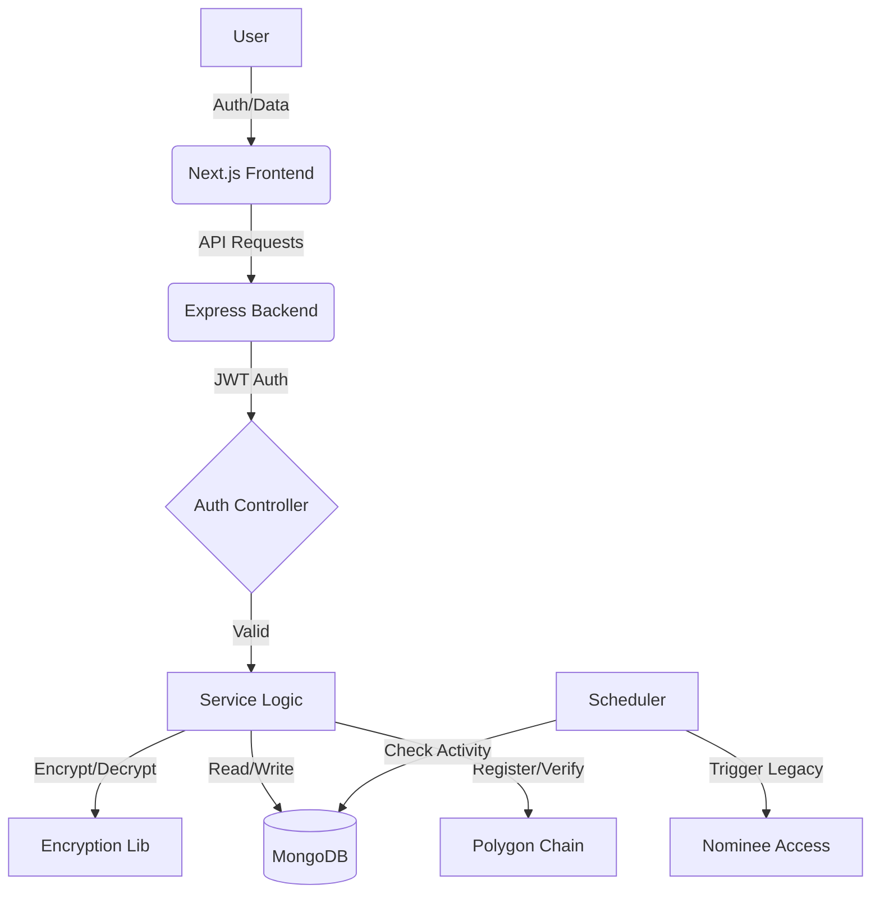

# Architecture Overview - SecureVault

SecureVault is built with a modern, decoupled architecture featuring a Next.js frontend and a Node.js/Express backend. This document provides a detailed overview of the system's design and security model.

## 🏗️ System Components

### 1. Frontend (Next.js)
- **Framework**: Next.js (App Router) for a performant, SEO-friendly, and maintainable codebase.
- **State Management**: React Hooks and Context API for global state.
- **UI Architecture**: Component-based design using Shadcn/Radix UI for accessible and consistent UI.
- **Authentication**: Client-side handling of JWT and integration with Google OAuth.
- **Web3 Integration**: MetaMask connectivity for decentralized ownership verification.

### 2. Backend (Node.js/Express)
- **API Engine**: Express.js handling RESTful API requests.
- **Language**: TypeScript for type safety and improved developer experience.
- **Security Middleware**: CORS for cross-origin protection, cookie-parser for session management, and JWT-based authorization.

### 3. Database (MongoDB)
- **Type**: NoSQL (MongoDB Atlas).
- **Schema Model**: Document-based, allowing for flexible storage of assets and user data.
- **Key Collections**: `users`, `assets`, `nominees`, `activity_logs`.

## 🛡️ Security Model

### 1. Data Encryption
Sensitive data is NEVER stored in plain text.
- **Algorithm**: `AES-256-CBC`.
- **Key Management**: Uses a 32-character hexadecimal key stored in environment variables.
- **Implementation**: Every encrypted string is prefixed with its Initialization Vector (IV) for maximum security (`iv:encryptedData`).
- **Tamper-Proofing**: A SHA-256 hash of each encrypted asset is stored on the Polygon blockchain to prevent unauthorized modifications.

### 2. Authentication Flow
SecureVault implements a dual-layer authentication strategy:
- **Layer 1**: Primary account access via email/password or Google OAuth.
- **Layer 2 (Optional)**: Secondary PIN verification for accessing highly sensitive assets.
- **Session Management**: Secure, HTTP-only cookies store JWT tokens to prevent XSS attacks.

### 3. Inactivity Monitoring & Legacy System
A unique feature of SecureVault is its "Dead Man's Switch" mechanism:
- **Scheduler**: A background task (Node-Cron or custom setInterval) monitors `last_activity` timestamps for users.
- **Triggers**: If a user is inactive for a user-defined threshold, the system triggers the legacy transfer process.
- **Execution**: Nominees are notified and granted access to the specific assets assigned to them.

## 🔄 Data Integrity & Flow

## 📂 File Storage
Assets that include file uploads are stored in the `backend/uploads/` directory. Metadata about these files (name, size, type) is stored in the database, while the files themselves are referenced by their unique disk paths.
