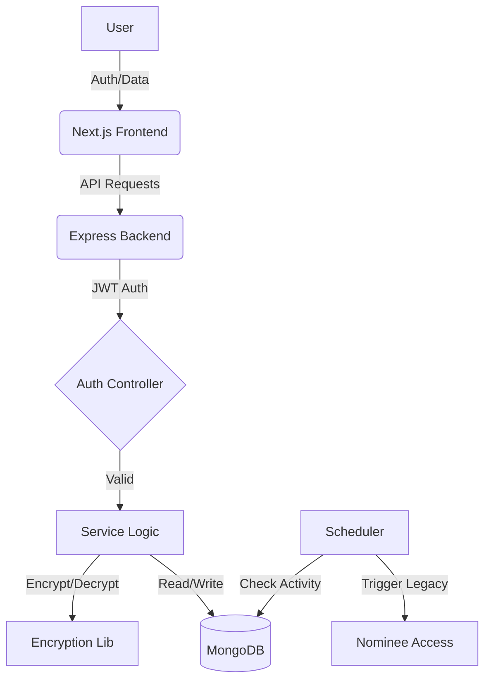

# Architecture Overview - SecureVault

SecureVault is built with a modern, decoupled architecture featuring a Next.js frontend and a Node.js/Express backend. This document provides a detailed overview of the system's design and security model.

## 🏗️ System Components

### 1. Frontend (Next.js)
- **Framework**: Next.js (App Router) for a performant, SEO-friendly, and maintainable codebase.
- **State Management**: React Hooks and Context API for global state.
- **UI Architecture**: Component-based design using Shadcn/Radix UI for accessible and consistent UI.
- **Authentication**: Client-side handling of JWT and integration with Google OAuth.

### 2. Backend (Node.js/Express)
- **API Engine**: Express.js handling RESTful API requests.
- **Language**: TypeScript for type safety and improved developer experience.
- **Security Middleware**: CORS for cross-origin protection, cookie-parser for session management, and JWT-based authorization.

### 3. Database (MongoDB)
- **Type**: NoSQL (MongoDB Atlas).
- **Schema Model**: Document-based, allowing for flexible storage of assets and user data.
- **Key Collections**: `users`, `assets`, `nominees`, `activity_logs`.

## 🛡️ Security Model

### 1. Data Encryption Flow
SecureVault follows a "Zero-Trust" principle for sensitive data.
- **Algorithm**: `AES-256-CBC` (Advanced Encryption Standard).
- **Process**:
    1. **Encryption**: When a user saves an asset (e.g., a password), the backend generates a random 16-byte Initialization Vector (IV). The data is encrypted using the shared `ENCRYPTION_KEY` and the IV.
    2. **Storage**: The IV and the encrypted ciphertext are combined (`iv:ciphertext`) and stored in MongoDB.
    3. **Decryption**: Upon an authorized request, the backend splits the string, extracts the IV, and decrypts the ciphertext using the key.
- **Key Management**: The `ENCRYPTION_KEY` is a 32-character hex string stored securely in environment variables.

### 3. Authentication & Authorization
- **JWT**: Secure authentication via JSON Web Tokens stored in HTTP-only, secure cookies.
- **RBAC**: Role-Based Access Control (Admin vs. User).
- **2FA/PIN**: Critical operations (like viewing top-secret assets) require a secondary 6-digit PIN.

## 🔄 The Legacy System (Dead Man's Switch)

The core innovation of SecureVault is its automated inheritance mechanism.

### 1. Activity Monitoring
A background scheduler (Node-Cron) runs at regular intervals:
- It checks the `lastActive` timestamp for each user.
- If `now - lastActive > userThreshold`, the user is flagged as "Inactive".

### 2. Inheritance Trigger
Once inactive, the system:
1. Verifies user inactivity threshold.
2. Generates a secure `nomineeAccessToken` for designated nominees.
3. Notifies nominees via Email/SMS.

### 3. Asset Access
Nominees can log in using their special token and OTP to view only the assets specifically designated for them by the original owner.

## 🔄 System Data Flow

## 📂 File Storage
Assets including file uploads are stored in `backend/uploads/`.
- Files are renamed using unique timestamps to prevent collisions.
- Only the file path and metadata (original name, mimetype) are stored in MongoDB.
- Access to these files is protected by the same JWT middleware as the API.
